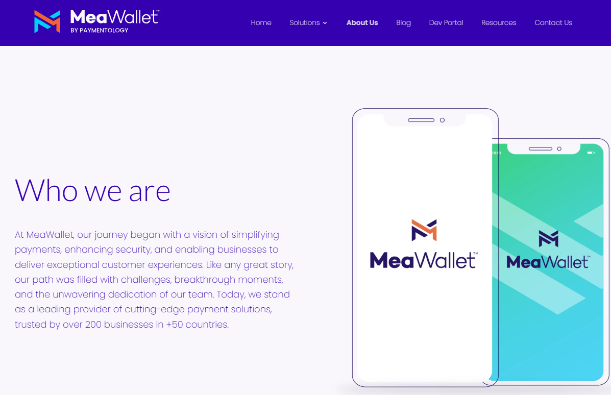

# MeaWallet internship 🗓️ Jan 2023 – May 2024

## Internship Description
During my 5–6 month internship, I mastered Python in an API focused environment. This included working with structured endpoints, header usage, query parameters, JSON payloads, and detailed response structures.

**Early stages of my internship:**
I was tasked with learning a new programming language **Python**, along with two key Python libraries: **Flask** and **Behave**. To support my learning, the company provided several Udemy courses, through which I acquired foundational knowledge of these technologies. Applying what I learned, I then developed a weather API application, structured to meet professional project standards.

**Midpoint of my internship:**
My next task was to implement a company project called the **Downtime Monitor**. The goal was straightforward: send a request to company servers and trigger a notification with a detailed description if the request failed. Although the concept sounded simple, I had to adapt to the company’s development environment. Since MEA Wallet handles sensitive card data, strict security measures were in place. Sending a request required adhering to complex encryption protocols. To better understand the companies custom functions and workflows, I used Behave, which provided test cases designed to demonstrate how to correctly send requests to the servers. A GitHub repository was created, where an company employee reviewed my code and provided constructive feedback, highlighting areas for improvement and pointing out mistakes.

**End of my internship:**
I successfully developed the Downtime Monitor, with the final step focused on making it **scalable** and compliant with company standards to facilitate the integration of additional APIs in the future. Additionally, I created a **Docker environment** running three instances of the application simultaneously, ensuring zero downtime during code updates by updating them one at a time until all instances were up to date. This seamless deployment was accomplished using Docker scripts.

## ℹ️ Disclaimer:
Due to the sensitive nature of the data and company confidentiality policies, I am unable to share the finalized version of this project publicly. However, I have included couple projects from the early stages of my internship that showcase my learning and progress during that period.

## Technologies Used  
- Languages: Python, Flask, Behave
- Tools: Postman, PyCharm
- APIs: [Geocode](https://geocode.xyz/api), [open-meteo]https://open-meteo.com/en/docs
- Database: MongoDB
