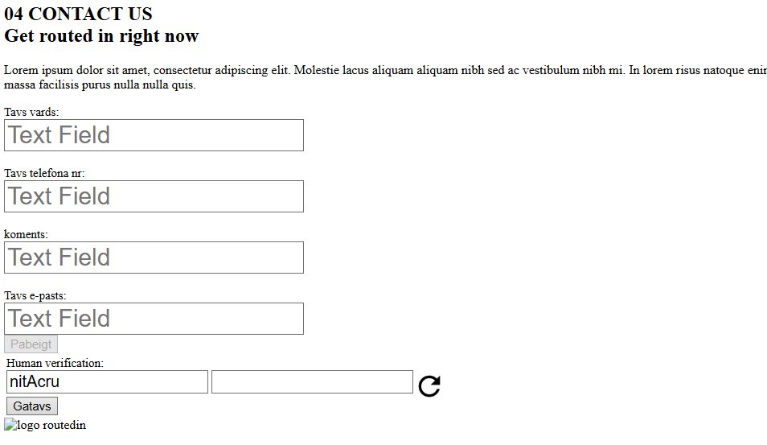

# RoutedIN internship 🗓️ Nov 2021 – Dec 2021

## Overview  
As part of a five member student team selected for the RoutedIN internship, I contributed to the development of a fully functional company website. My primary responsibility was building the Contact Me section, which included:

1. Implementing input validation,
2. Integrating CAPTCHA,
3. Sending form data for SMTP-based email processing.

## Features

- Input Validation: Ensured that all form fields were correctly validated on the client side to prevent invalid submissions.
- CAPTCHA Integration: Added basic CAPTCHA to protect against spam and automated submissions.
- SMTP Email Handling: Configured the form to send user messages via SMTP for secure and reliable delivery.

## How to Run

1. Open `templates/Test.html `.

