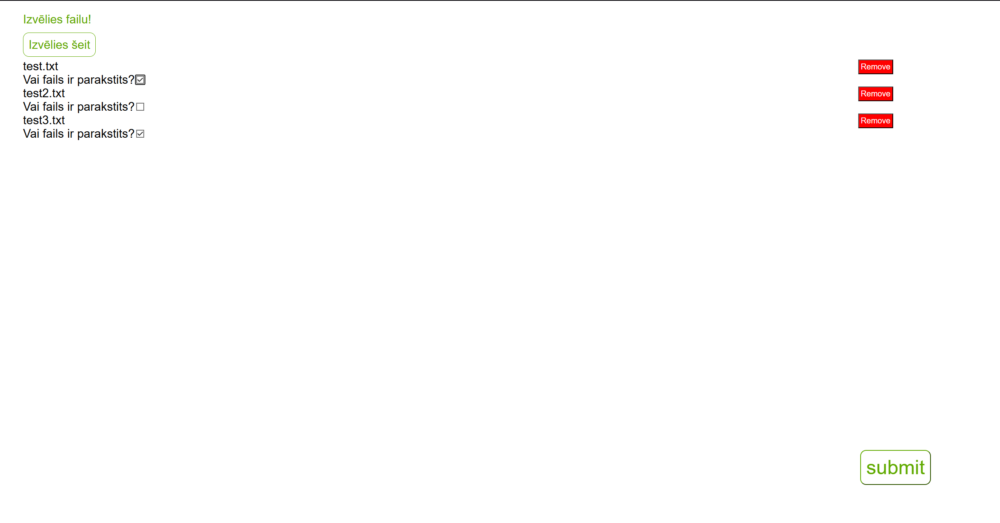
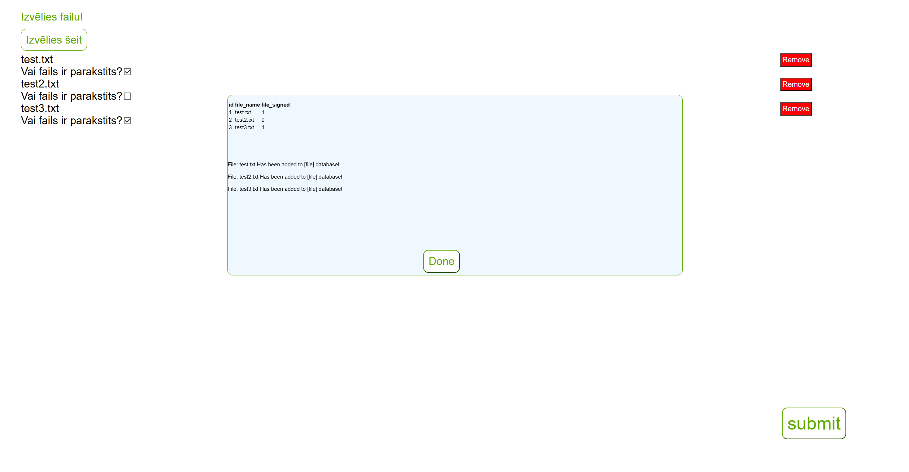

# 2022-11 - 2022-12 edy365 Signed File




## Overview  
My second task during the internship was to create a website where users can add files and check a checkbox to indicate whether each file is signed. Upon submission, the file names and their signed status are saved to a database.

## Features

- You can remove the file by clicking remove buttons, thus it won't get saved to the database.
- Saving multiple files at a time.
- Color theme, that fits edy365 website design.
- A popup notification confirms successful submission.

## How to Run

1. Open windows terminal.
2. Type ```cd <route to projects main folder>```.
3. Then type: ```php -S localhost:8000```.
4. Open your web browser and enter **http://localhost:8000**.
