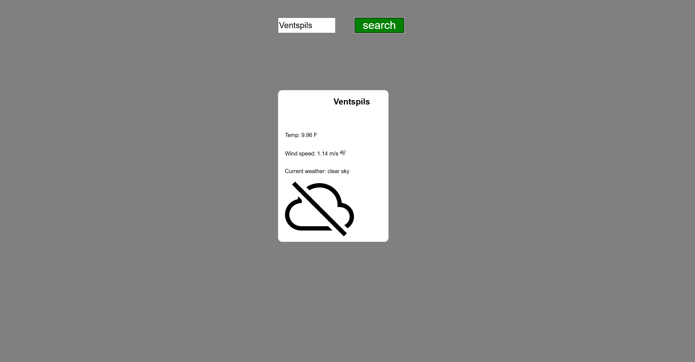

# 2022-11 - 2022-12 edy365 Weather-api




## Overview
First task given by my internship provider was to create a simple **weather-api webpage**, that uses api provided by **https://openweathermap.org** and includes icons from: **[W3 Icons](https://design-system.w3.org/styles/svg-icons.html)**.

## Features

- Repeatedly send requests to the API by entering a city or country name in the input field.
- Uses Icons to display current weather conditions.

## How to Run

1. Open windows terminal.
2. Type ```cd <route to projects main folder>```.
3. Then type: ```php -S localhost:8000```.
4. Open your web browser and enter **http://localhost:8000**.

